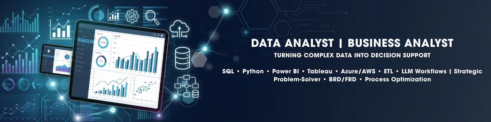

<!-- ================= HEADER BANNER ================= -->

  

<h1 align="center">Hi, I'm Nethra 👋</h1>

<h3 align="center">Data Analyst | ML Engineer | Business Analyst</h3>

Turning complex data into actionable insights, dashboards, and intelligent systems.

<!-- ================= BADGES ================= -->

## 🏆 Certifications & Badges

<!-- ================= ABOUT ================= -->

## 👩‍💻 About Me

- 🎓 MS in Computer Science graduate  
- 📊 Data Analyst with enterprise + academic experience  
- 🤖 Passionate about ML, forecasting & data-driven systems  
- ☁️ Experienced with AWS, Azure, ETL pipelines  
- 🚀 Building end-to-end analytics + AI systems  

---

<!-- ================= SKILLS ================= -->

## 🛠️ Tech Stack

**Languages:** Python, SQL, JavaScript  
**Data/ML:** Pandas, NumPy, Scikit-learn, TensorFlow  
**Visualization:** Tableau, Power BI, Matplotlib  
**Databases:** PostgreSQL, SQL Server, MySQL  
**Cloud/ETL:** AWS, Azure Synapse, Airflow, Informatica  
**Web:** React, Next.js, Node.js  

---

<!-- ================= FEATURED CASE STUDY ================= -->

## 📊 ⭐ Featured Projects

### 📊 Retail Sales Analytics & Forecasting (Flagship Project)
End-to-end data pipeline for retail insights and demand forecasting.

- Built SQL-based data warehouse (18,000+ records)
- Performed EDA using Python (Pandas, NumPy)
- Developed forecasting model using moving averages
- Designed interactive Tableau dashboard for business insights
- Identified revenue drivers, regional trends, and seasonality patterns

🔗 [View Project](https://github.com/Nethra-RS/Retail-Sales-Analytics)

**Tech Stack:** SQL | Python | Tableau | Data Analysis | Forecasting

---

### 🧠 Diabetic Retinopathy Detection (Deep Learning)
Medical image classification using CNN-based deep learning model.

- Built CNN/ResNet-based classification pipeline
- Applied image preprocessing and augmentation
- Evaluated model performance using accuracy metrics

🔗 [View Project](https://github.com/Nethra-RS/DR_Detection)

**Tech Stack:** Python | TensorFlow/Keras | CNN | Deep Learning

---

### 🏋️ Fitness Tracker App (Full Stack)
Health tracking web application with real-time data visualization.

- Built frontend using React/Next.js
- Integrated APIs for fitness metrics (steps, calories, heart rate)
- Designed dashboard for user health insights

🔗 [View Project](https://github.com/Nethra-RS/track_fit_fe)

**Tech Stack:** React | Next.js | APIs | JavaScript | UI Design

---

### 💰 Personal Finance Analyzer
Financial data analysis tool for expense tracking and insights.

- Analyzed income & expense patterns using Python
- Built SQL queries for structured financial insights
- Created visual summaries for spending behavior

🔗 [View Project](https://github.com/Nethra-RS/personal-finance-analyzer)

**Tech Stack:** Python | SQL | Data Analysis | Visualization

---

### 📊 Sales Analysis Dashboard
Business intelligence dashboard for sales KPIs and reporting.

- Built SQL-based analytical queries
- Designed dashboards for KPI tracking
- Performed business trend analysis

🔗 [View Project](https://github.com/Nethra-RS/Sales_Analysis)

**Tech Stack:** SQL | Power BI/Tableau | Data Visualization

---

### 🛍️ Student Swap Shop (Full Stack Marketplace)
Student-focused exchange platform for buying/selling items.

- Built full-stack web application
- Implemented authentication and product listing system
- Designed responsive UI for users

🔗 [View Project](https://github.com/Nethra-RS/Student-swap-shop)

**Tech Stack:** Full Stack | Web Development | Database | UI/UX

<!-- ================= CONNECT ================= -->

## 📫 Let's Connect

💼 LinkedIn: [https://linkedin.com/in/your-link](https://www.linkedin.com/in/n-renjarla-920b3a197/)  
📧 Email: nethrarenjarla@gmail.com  

---

⭐ "I turn data into decisions, and decisions into measurable impact."
